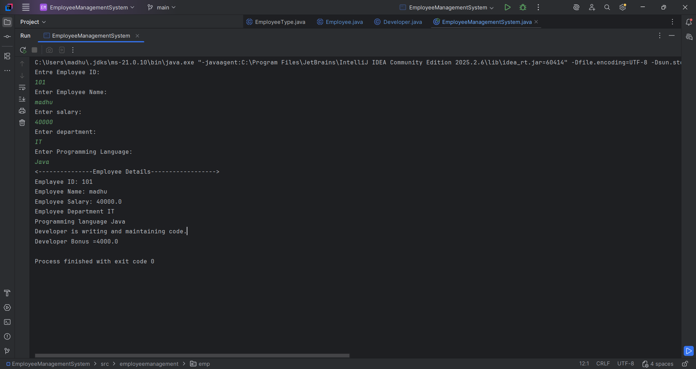
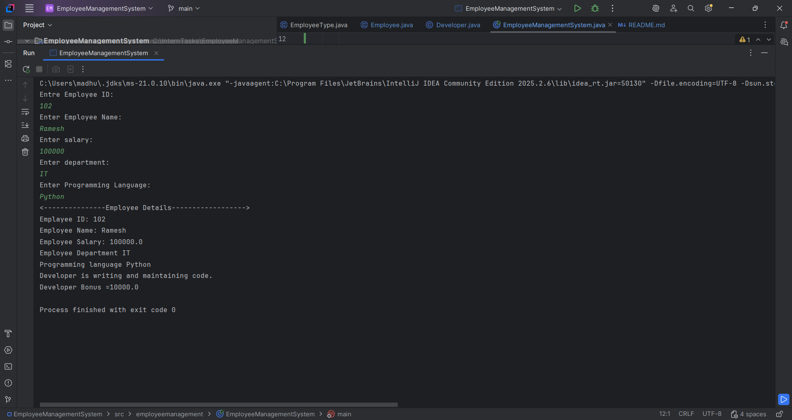

# Employee Management System

## Assignment Objective

Develop a structured Java application using OOP and advanced Java language concepts. The project demonstrates classes, objects, constructors, encapsulation, inheritance, abstraction, interfaces, polymorphism, exception handling, packages, and clean-code practices.

## Problem Statement

Create a console-based employee management system that stores employee details, validates salary, calculates bonuses, and manages developer-specific behavior. The application should be designed using proper object-oriented principles and should use meaningful package organization.

## Project Description

This system allows the user to enter employee information including:

- Employee ID
- Employee Name
- Salary
- Department
- Programming Language

The program validates whether the salary is valid and prevents invalid negative values using a custom exception. It then creates a Developer object and displays the employee details along with bonus and work information.

## Core Features

- Employee data collection through the console
- Salary validation with custom exception handling
- Developer-specific attributes and behavior
- Developer bonus calculated as 10% of the employee's stored salary
- Display of employee information
- Inheritance and abstraction design
- Package-based organization
- Clean and readable Java code structure

## OOP Concepts Implemented

### 1. Classes and Objects

- Employee details are represented as Java classes.
- Objects are created to represent individual employees.

### 2. Constructors

- Constructors are used to initialize employee data during object creation.

### 3. Encapsulation

- Data fields are kept private to restrict direct access.
- Access is controlled through class logic and constructor initialization.

### 4. Inheritance

- The Developer class inherits from the Employee class.
- This demonstrates reusability and specialization of behavior.

### 5. Abstraction

- The EmployeeType class is abstract.
- Common employee behavior is defined at the abstract level.

### 6. Interfaces

- The Bonus interface defines a contract for bonus calculation.
- Classes implementing the interface provide the concrete implementation.

### 7. Polymorphism

- `Developer` overrides `calculateWork()` from the abstract `EmployeeType` class.
- The application stores a `Developer` object in an `EmployeeType` reference and calls `calculateWork()`, demonstrating runtime polymorphism.

### 8. Exception Handling

- Negative salaries are rejected using InvalidSalaryException.
- The project handles errors gracefully without crashing the program.

### 9. Packages

- Code is organized into logical packages such as:
  - employeemanagement
  - employeemanagement.emp
  - employeemanagement.dev
  - employeemanagement.exception
  - employeemanagement.salary

### 10. Clean-Code Principles

- Meaningful naming
- Small and focused classes
- Separation of responsibilities
- Clear method structure
- Readable output messages

## Project Structure

```text
EmployeeManagementSystem/
├── src/
│   └── employeemanagement/
│       ├── EmployeeManagementSystem.java
│       ├── EmployeeType.java
│       ├── dev/
│       │   └── Developer.java
│       ├── emp/
│       │   └── Employee.java
│       ├── exception/
│       │   └── InvalidSalaryException.java
│       └── salary/
│           └── Bonus.java
├── README.md
└── EmployeeManagementSystem.iml
```

## Technology Used

- Java
- Object-Oriented Programming
- Java Exception Handling
- Console-based user input and output

## How to Run the Program

### 1. Compile the project

Open PowerShell in the project root and run:

```powershell
javac -d out (Get-ChildItem -Recurse -Filter *.java | ForEach-Object { $_.FullName })
```

### 2. Run the application

```powershell
java -cp out employeemanagement.EmployeeManagementSystem
```

## Test Case Screenshots

The screenshots below show two successful runs. Both include the entered department and programming language, and the displayed developer bonus is 10% of the stored salary.

### Test Case 1



### Test Case 2



## Example Flow

The console asks for:

- Employee ID
- Employee name
- Salary
- Department
- Programming language

Then it displays the employee details and calculates the developer bonus.

## Expected Outcome

This project satisfies the assignment requirement by showcasing a well-structured Java application that applies core and advanced OOP concepts in a real-world scenario.

## Notes

This is a simple but effective Java internship project designed to practice clean object-oriented design, proper Java structure, and software engineering fundamentals.
